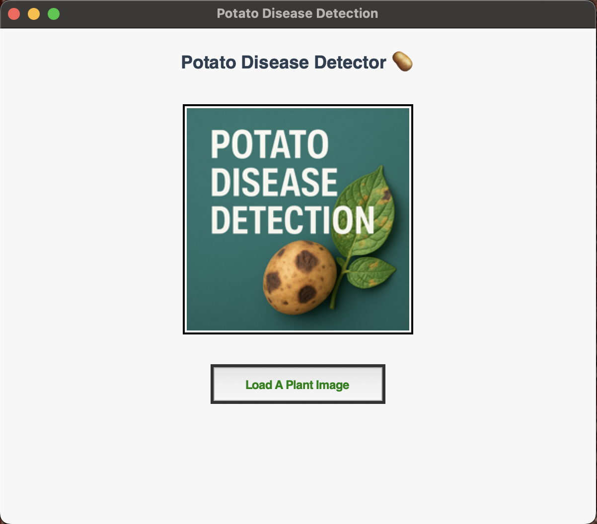
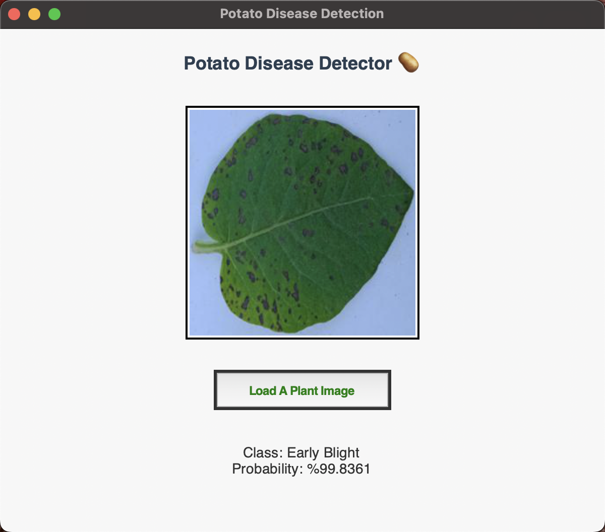

# 🥔 Potato Disease Detection

This project aims to detect diseases in potato leaves using deep learning-based image classification models. Early detection of plant diseases is critical for reducing crop loss and improving agricultural efficiency.

## 📚 Dataset

The dataset used in this project is the [Potato Disease Leaf Dataset (PLD)](https://www.kaggle.com/datasets/rizwan123456789/potato-disease-leaf-datasetpld), available on Kaggle.

It includes images of potato leaves categorized into 3 classes:

- **Early Blight**
- **Late Blight**
- **Healthy**

The dataset contains high-resolution, labeled RGB images, which were used for training and testing the models.

## 🧠 Deep Learning Models

The following deep learning architectures were trained and evaluated:

- **VGG16**
- **LeNet**
- **ResNet**
- **GoogleNet**
- **MobileNet**

Pre-trained models (VGG16, ResNet, GoogleNet, and MobileNet) were used with transfer learning, where the top layers were replaced and fine-tuned on the potato disease dataset.

## 📊 Results

The following table shows the accuracy values for each model on each class.

| Class          | VGG16 | LeNet | ResNet | GoogleNet | MobileNet |
|----------------|-------|-------|--------|-----------|-----------|
| Early Blight   | 0.86  |  0.85 |  0.98  |    0.97   |   0.93    |
| Late Blight    | 0.86  |  0.78 |  0.97  |    0.94   |   0.91    |
| Healthy        | 0.85  |  0.84 |  0.97  |    0.95   |   0.90    |

> 🧪 **Note:** The values represent test set f1-score after model training and evaluation.

|                      | VGG16 | LeNet | ResNet | GoogleNet | MobileNet |
|----------------------|-------|-------|--------|-----------|-----------|
| **Overall Accuracy** | 0.86  |  0.83 |  0.97  |   0.96    |   0.91    |

> 🧪 **Note:** The values represent test set accuracy after model training and evaluation.

## 🏗️ Project Structure

```
potato-disease-detection/
│
├── data/                        # Original dataset downloaded from Kaggle
│   ├── pdd.png                  # Used in GUI
├── notebooks/                   # Jupyter notebooks for training and evaluation
├── model/                       # Trained model with weights
├── src/                         # Core Python scripts (training, preprocessing, etc.)
│   ├── class_indices.json       # Created during training, used in model prediction
│   ├── main.py                  # File containing the GUI and plant classification code
│   ├── train_models.ipynb       # Jupyter notebook for training and evaluation
├── README.md                    # Project documentation
└── requirements.txt             # Required Python libraries
```

## ⚙️ Installation

To run the project on your local machine:

1. Clone this repository:  
```bash
   git clone https://github.com/stungac/potato-disease-detection.git  
   cd potato-disease-detection  
```

2. Create and activate a virtual environment:  
```bash
   python -m venv env  
   On Linux/Mac: source env/bin/activate  
   On Windows: env\Scripts\activate  
```

3. Install the required Python libraries:  
```bash
   pip install -r requirements.txt  
```

4. Run the app script:  
```bash
   python src/main.py 
```

## Sample Results

  

## Contribution

Contributions are welcome! If you find bugs or have suggestions, feel free to open an issue or submit a pull request.

---
